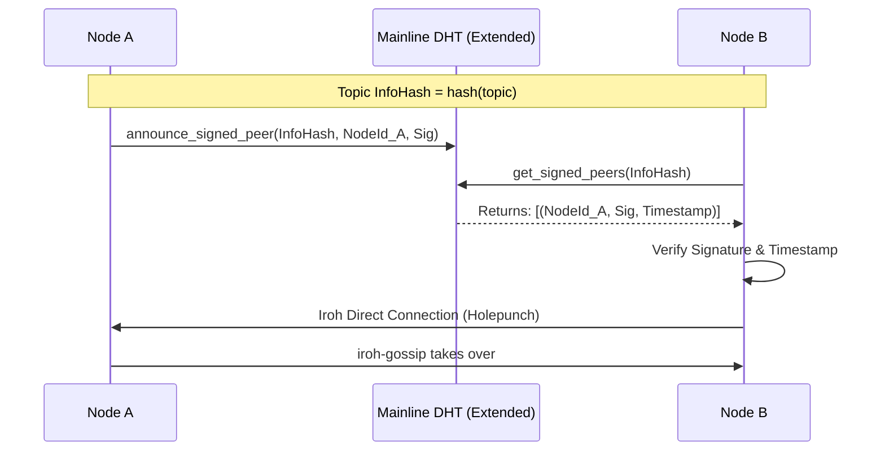

# iroh-topic-tracker

[](https://crates.io/crates/iroh-topic-tracker)
[](https://docs.rs/iroh-topic-tracker)
[](LICENSE-MIT)

Serverless, decentralized peer discovery for `iroh-gossip` topics using experimental **DHT Signed Peer Announcements**.

This crate uses the implementation of the experimental **Draft BEP** ([PR #174](https://github.com/bittorrent/bittorrent.org/pull/174)) for announcing and discovering cryptographically signed peer identities (Ed25519 public keys) on the Mainline DHT by [@Nuhvi](https://github.com/Nuhvi). This enables overlay networks like Iroh to discover peers without centralized trackers, utilizing signed announcements to verify identity before connection.

## Architecture

Instead of announcing IP addresses, peers announce their **EndpointId** (Ed25519 public key) signed with a timestamp. This allows for secure, trackerless discovery where connection establishment and NAT traversal are handled entirely by Iroh.



## Features

- Ed25519 signature based discovery using `announce_signed_peer` / `get_signed_peers` extensions.
- Relies on public DHT nodes supporting the extension (e.g. Mainline DHT with PR #174, there are two atm to my knowledge + all iroh-topic-tracker participants).
- Prevents identity spoofing via Ed25519 signatures. (todo: check signature validity)

## Usage

Add to `Cargo.toml`:

```toml
[dependencies]
iroh = "1.0.0-rc.1"
iroh-gossip = "0.100"
iroh-topic-tracker = "0.2.0-rc.0"
```

Subscribe to a topic with automatic discovery:

```rust
use std::time::Duration;
use futures_lite::StreamExt;
use iroh::{Endpoint, SecretKey, protocol::Router};
use iroh_gossip::net::Gossip;

use iroh_topic_tracker::{TopicDiscoveryConfig, TopicDiscoveryExt};

#[tokio::main]
async fn main() -> anyhow::Result<()> {
    let secret_key = SecretKey::generate(&mut rand::rng());

    let endpoint = Endpoint::builder()
        .secret_key(secret_key.clone())
        .bind()
        .await?;

    let gossip = Gossip::builder().spawn(endpoint.clone());

    let _router = Router::builder(endpoint.clone())
        .accept(iroh_gossip::ALPN, gossip.clone())
        .spawn();

    let topic_id = "testnet".as_bytes().to_vec();
    let config = TopicDiscoveryConfig::builder(endpoint)
        .max_peers_per_round(Some(5))
        .connection_timeout(Duration::from_secs(10))
        .build();

    println!("Starting subscription to topic...");
    let (sender, mut receiver, discovery_handle) = gossip
        .subscribe_with_discovery_joined(topic_id, vec![], config)
        .await?;

    println!("Subscribed to topic and joined the network.");

    println!("Broadcasting hello world...");
    sender
        .broadcast(format!("hello world {}", rand::random::<u32>()).into())
        .await?;


    discovery_handle.stop();

    Ok(())
}

```

## References

- [Draft BEP: DHT Signed Peer Announcements (PR #174)](https://github.com/bittorrent/bittorrent.org/pull/174)

## License

Dual-licensed under [Apache 2.0](LICENSE-APACHE.txt) and [MIT](LICENSE-MIT.txt).
